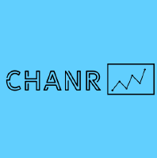

# Data Science Driven Approach to Analyzing GMO and Non-GMO Consumer Behavior  

#### Student: Sudharsan Gopalakrishnan

#### Mentors: Claire Kim, Rishov Chatterjee, Nishant Jain

#### Initial Timeline: 4 Months

The timeline is not final and the student may extend his involvement period with ChanR's internal projects and in his personal project in a consulting meeting with the mentors.

## Learning Component

Student will be independently navigating the following core topics of study:

1. Social media data mining to learn more about people’s perception about GMO.
2. Curating the data: applying NLP to process and analyze the unstructured data.
3. Visualization of language (word cloud, clustering, embeddings (word2vec models), tf-idf) https://projector.tensorflow.org/
4. Time-series analysis.
5. Offer a potential solution to change consumer’s perception about GMO-derived products depending on the research findings and analysis.

1 to 2 projects will be completed involving data analysis and presentation of the finding.
Student is encouraged to communicate with mentors in the search of data.

Resources for learning will be provided to student in the following formats:

1. Video Courses
2. Research Papers
3. Blog Tutorials
4. ChanR Meetups

Any work done in this component is allowed to be shared to any capacity the student sees fit. This may include conference presentations, science fair projects, etc.

## Internship Component

This is an optional component for students to collaborate with members of ChanR on ChanR initiatives.

While putting in efforts in the above learning component, Sudharsan can hone his skills in the following ChanR teams:

1. DataFit. Image classification, clustering and segmentation to assess the amount of nutrients and GMO components in food.
2. Potential partnership with Ethegra

Any work done in the internship component would be done in parallel with the learning component.

Work done in this component cannot be shared with people outside of ChanR.

## Important Information

Student must have communication with mentors at least twice a week. Timing can be flexible or during specific times. Communication will happen via the following tools:

- Discord
- Zoom Calls
- GitHub

The student is allowed to bring other students for collaboration as long those students are also students of the PICDS program. To set up collaborations with other students, please contact mentors.

Payment for the program is not required in the beginning of the program, but will be required at some point during the program's duration. Mentors will contact student about the process of payment.

ChanR offers a no refund policy once student agrees to start the program. Payment will only be taken based on the months of work put into the program as discussed by the student and mentors.
